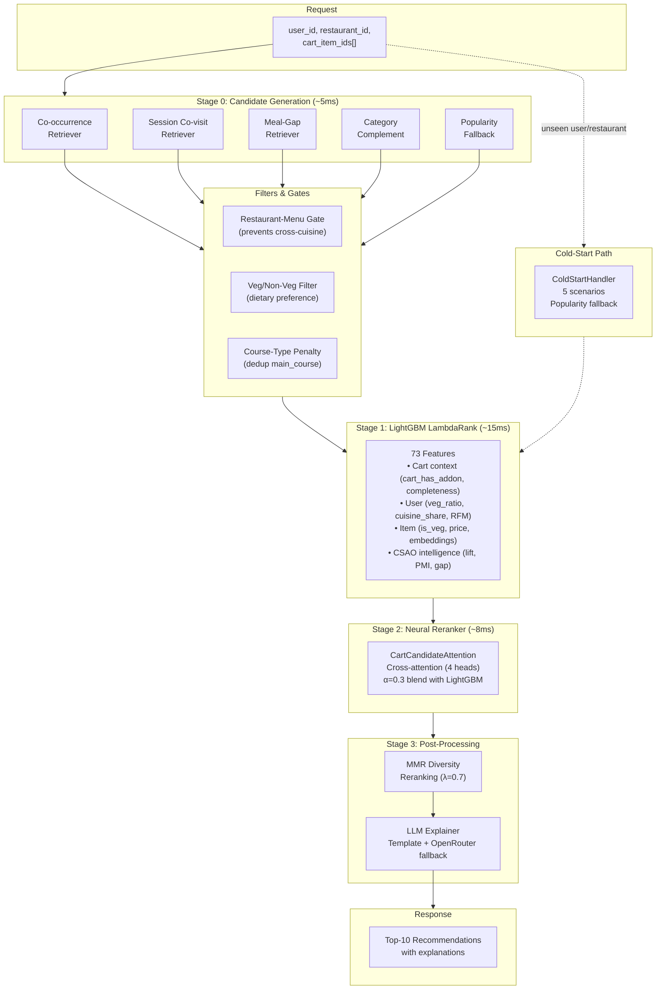
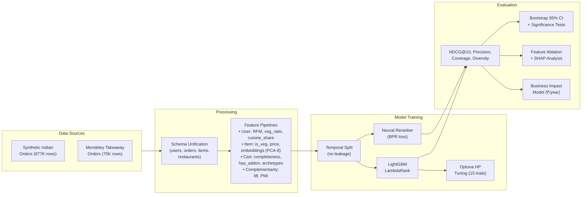

# Architecture Diagram

## Full CSAO Serving Pipeline

```mermaid
flowchart TD
    subgraph INPUT["Request"]
        REQ["user_id, restaurant_id,\ncart_item_ids[]"]
    end

    subgraph STAGE0["Stage 0: Candidate Generation (~5ms)"]
        direction LR
        R1["Co-occurrence\nRetriever"]
        R2["Session Co-visit\nRetriever"]
        R3["Meal-Gap\nRetriever"]
        R4["Category\nComplement"]
        R5["Popularity\nFallback"]
    end

    subgraph GATES["Filters & Gates"]
        MENU["Restaurant-Menu Gate\n(prevents cross-cuisine)"]
        VEG["Veg/Non-Veg Filter\n(dietary preference)"]
        COURSE["Course-Type Penalty\n(dedup main_course)"]
    end

    subgraph STAGE1["Stage 1: LightGBM LambdaRank (~15ms)"]
        LGBM["73 Features\n• Cart context (cart_has_addon, completeness)\n• User (veg_ratio, cuisine_share, RFM)\n• Item (is_veg, price, embeddings)\n• CSAO intelligence (lift, PMI, gap)"]
    end

    subgraph STAGE2["Stage 2: Neural Reranker (~8ms)"]
        NEURAL["CartCandidateAttention\nCross-attention (4 heads)\nα=0.3 blend with LightGBM"]
    end

    subgraph STAGE3["Stage 3: Post-Processing"]
        MMR["MMR Diversity\nReranking (λ=0.7)"]
        LLM["LLM Explainer\nTemplate + OpenRouter fallback"]
    end

    subgraph OUTPUT["Response"]
        TOP10["Top-10 Recommendations\nwith explanations"]
    end

    subgraph COLD["Cold-Start Path"]
        CS["ColdStartHandler\n5 scenarios\nPopularity fallback"]
    end

    REQ --> STAGE0
    R1 & R2 & R3 & R4 & R5 --> GATES
    GATES --> STAGE1
    STAGE1 --> STAGE2
    STAGE2 --> STAGE3
    MMR --> LLM
    LLM --> OUTPUT
    REQ -.->|"unseen user/restaurant"| COLD
    COLD -.-> STAGE1
```

## Offline Training Pipeline

```mermaid
flowchart LR
    subgraph DATA["Data Sources"]
        SYN["Synthetic Indian\nOrders (877K rows)"]
        MEN["Mendeley Takeaway\nOrders (75K rows)"]
    end

    subgraph PROCESS["Processing"]
        UNIFY["Schema Unification\n(users, orders, items,\nrestaurants)"]
        FEAT["Feature Pipelines\n• User: RFM, veg_ratio,\n  cuisine_share\n• Item: is_veg, price,\n  embeddings (PCA-8)\n• Cart: completeness,\n  has_addon, archetypes\n• Complementarity:\n  lift, PMI"]
    end

    subgraph TRAIN["Model Training"]
        SPLIT["Temporal Split\n(no leakage)"]
        LTR["LightGBM\nLambdaRank"]
        NR["Neural Reranker\n(BPR loss)"]
        HP["Optuna HP\nTuning (15 trials)"]
    end

    subgraph EVAL["Evaluation"]
        METRICS["NDCG@10, Precision,\nCoverage, Diversity"]
        BOOT["Bootstrap 95% CI\n+ Significance Tests"]
        ABLATION["Feature Ablation\n+ SHAP Analysis"]
        BIZ["Business Impact\nModel (₹/year)"]
    end

    DATA --> UNIFY --> FEAT --> SPLIT
    SPLIT --> LTR & NR
    LTR --> HP
    LTR & NR --> METRICS
    METRICS --> BOOT & ABLATION & BIZ
```
