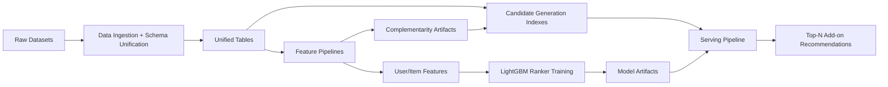

# Architecture Diagram

```mermaid
flowchart LR
    A[Raw Datasets] --> B[Data Ingestion + Schema Unification]
    B --> C[Unified Tables]
    C --> D[Feature Pipelines]
    D --> E[Complementarity Artifacts]
    D --> F[User/Item Features]
    C --> G[Candidate Generation Indexes]
    E --> G
    F --> H[LightGBM Ranker Training]
    H --> I[Model Artifacts]
    G --> J[Serving Pipeline]
    I --> J
    J --> K[Top-N Add-on Recommendations]
```
